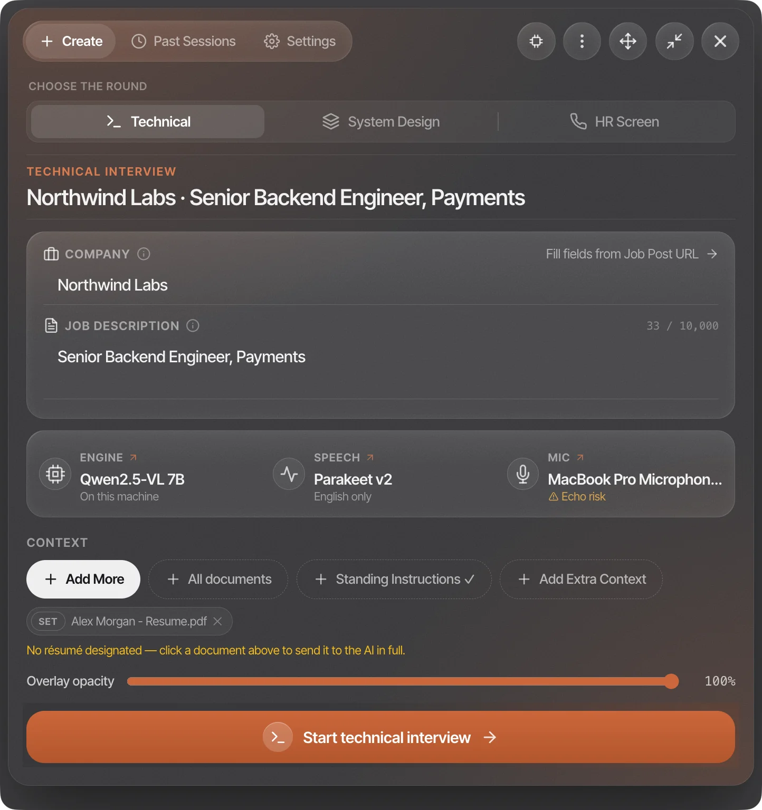
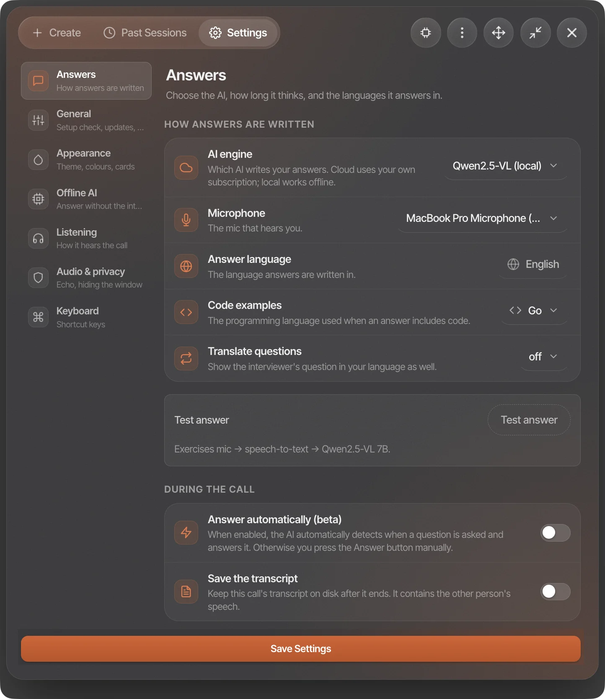

<div align="center">

# Phoenix

An AI assistant for job interviews, for macOS and Windows.

It listens to the call, writes down what both sides say, and shows suggested answers in a small
overlay that doesn't show up when you share your screen.

[](../../releases/latest)
[](#macos)
[](#windows)

**[Website and screenshots](https://mailtoharutyunyan.github.io/phoenix-releases/)**


</div>

## What it does

<table>
<tr>
<td width="50%"><br><sub>Before the call you add the company, the job description and the kind of round: technical, system design or HR.</sub></td>
<td width="50%"><br><sub>Settings let you pick the model, the answer length and how much it thinks first. Every shortcut can be rebound.</sub></td>
</tr>
<tr>
<td colspan="2"><br><sub>In system design rounds it draws the architecture next to the answer: tiers, a numbered request path, and extra components held back until you need them.</sub></td>
</tr>
</table>

- Hears your mic and the interviewer's audio separately, so it knows who asked what.
- Hidden from screen sharing. This is on by default.
- Usually starts answering in about a second and a half.
- Can read your screen: take a screenshot of a coding task and ask about it.
- Splits multi-part questions into chips that tick off as you answer, suggests likely follow-ups, and lets you bookmark moments to review after the call.
- Speech-to-text runs on your computer. Audio is never uploaded.
- Works offline with the built-in local model. No account or API key needed.

## Install

### macOS

Open Terminal and paste:

```bash
curl -fsSL https://github.com/mailtoharutyunyan/phoenix-releases/releases/latest/download/install.sh | bash
```

It downloads the latest version, checks its signature, puts it in `/Applications` and opens it.

If you get `error: 429`, GitHub is rate-limiting you. Try this mirror instead, or wait a few minutes:

```bash
curl -fsSL https://cdn.jsdelivr.net/gh/mailtoharutyunyan/phoenix-releases@main/install.sh | bash
```

Apple Silicon (M1 or newer) only. There's no Intel build.

<details>
<summary>Why a Terminal command and not a normal download?</summary>

I don't have a paid Apple developer certificate. When you download an unsigned app in a browser,
macOS marks it and then says it's "damaged" or "can't be verified". It isn't damaged. Files
downloaded with `curl` don't get that mark, so the app just opens. The script doesn't change the app
and it checks the signature before installing. You can [read it](install.sh) first.

If you already downloaded it in a browser and macOS won't open it, see
[Troubleshooting](docs/troubleshooting.md#macos-says-the-app-is-damaged-or-unverified).
</details>

<details>
<summary>Install by hand</summary>

```bash
URL=$(curl -fsSL https://api.github.com/repos/mailtoharutyunyan/phoenix-releases/releases/latest \
  | grep -o 'https://[^"]*arm64-mac\.zip') \
  && curl -L# "$URL" -o /tmp/phoenix.zip \
  && rm -rf /Applications/Phoenix.app \
  && unzip -q /tmp/phoenix.zip -d /Applications \
  && rm /tmp/phoenix.zip \
  && open /Applications/Phoenix.app
```
</details>

### Windows

Open PowerShell and paste:

```powershell
irm https://github.com/mailtoharutyunyan/phoenix-releases/releases/latest/download/install.ps1 | iex
```

It downloads the installer, checks that the download is complete, and runs it.

Windows will show "Windows protected your PC". That's because the installer isn't signed, not
because anything was detected. Click **More info**, then **Run anyway**.

The script can check that the file arrived intact, but without a code-signing certificate it can't
prove who built it. It prints the file's SHA-256 so you can compare it with the release page.
[Read the script](install.ps1) if you want to see exactly what it does.

x64 only. It runs on ARM laptops through emulation, but speech recognition falls back to Whisper
there.

## Updating

Phoenix checks for updates when it starts and installs them itself, on both macOS and Windows.
You can also run the install command again at any time.

On macOS you'll need to allow Microphone and Screen Recording again after each update. That's a side
effect of the app not being signed, [more here](docs/troubleshooting.md#i-have-to-grant-permissions-again-after-every-update).

## Requirements

- **macOS:** Apple Silicon, macOS 14 or newer
- **Windows:** x64, Windows 10 or newer
- **Disk:** about 2 GB, plus 3 to 5 GB if you use a local model
- **Memory:** 16 GB recommended for running a model locally

## Docs

- [Getting started](docs/getting-started.md): permissions and your first session
- [During a call](docs/during-a-call.md): the overlay, screenshots, system design
- [Keyboard shortcuts](docs/shortcuts.md)
- [Settings](docs/settings.md): models, speech engine, staying hidden
- [Privacy](docs/privacy.md): what's stored and what leaves your machine
- [Troubleshooting](docs/troubleshooting.md)
