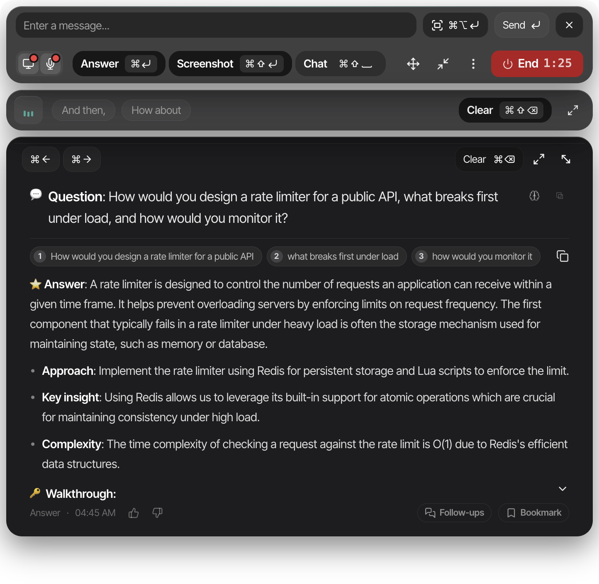
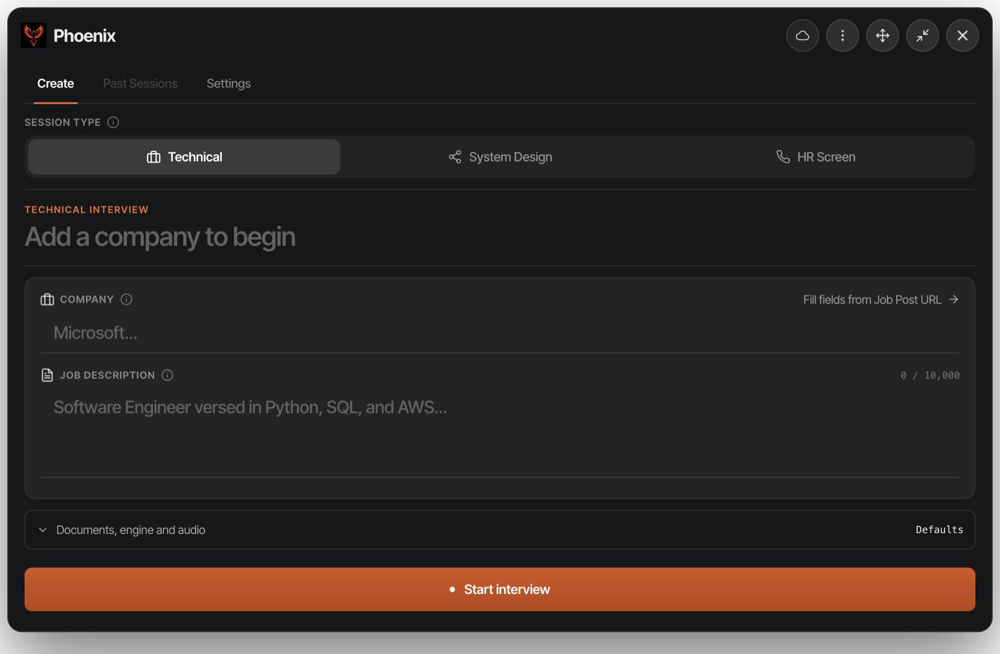
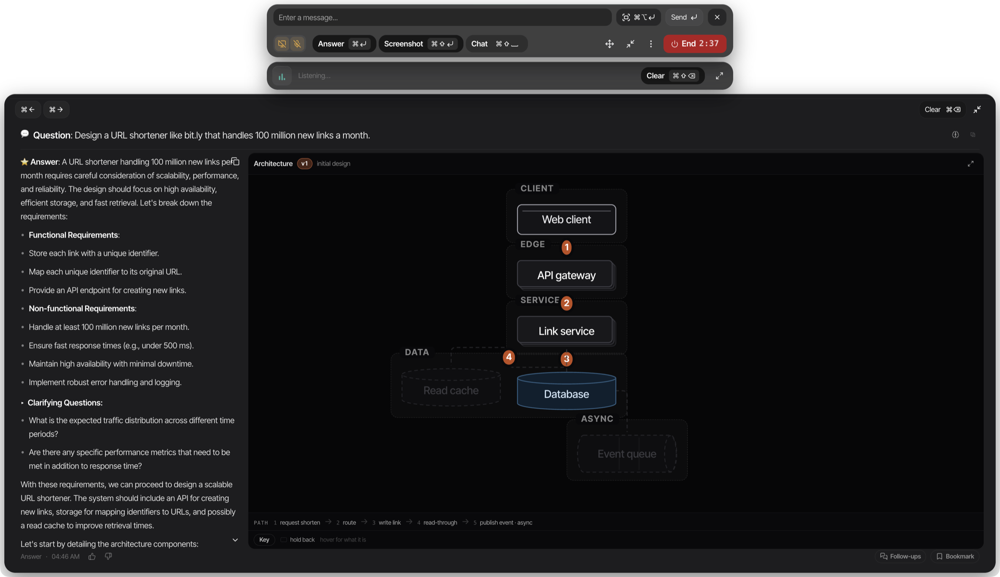

<div align="center">

# Phoenix

**An AI interview assistant for macOS and Windows. It listens to a call,
transcribes both sides, and streams answers into an overlay that stays out of your screen share.**

Speech recognition, document search, and — if you want it — the language model itself
all run on your own machine.

[](../../releases/latest)
[](../../releases/latest)
[](#install-on-windows)

**[Website and screenshots &raquo;](https://mailtoharutyunyan.github.io/phoenix-releases/)**



</div>

---

## What it looks like

<table>
<tr>
<td width="50%"><br><sub><b>Before the call.</b> Company, job description and round type &mdash; technical, system design or HR screen.</sub></td>
<td width="50%"><br><sub><b>System design rounds.</b> The architecture is drawn beside the answer, as a separate request, so your words never wait for the picture.</sub></td>
</tr>
</table>

| | |
|:--|:--|
| **Hears both sides** | Your mic and the interviewer's audio, captured separately and labelled. |
| **Invisible to screen sharing** | Excluded from screen capture at the window level. On by default. |
| **Answers in about 1.5s** | A warm session is kept ready between questions. |
| **Reads your screen** | Screenshot the exercise and it answers about what is on it. |
| **Speech stays on your machine** | Transcription runs on-device; no audio is uploaded, ever. |
| **Works offline** | Switch to the bundled local model. No account, no API key. |

---

## Install on macOS

One command. Paste it into Terminal:

```bash
curl -fsSL https://github.com/mailtoharutyunyan/phoenix-releases/releases/latest/download/install.sh | bash
```

That downloads the current release, verifies its signature, installs it to `/Applications`, and
opens it. **macOS will not block it, and you will not have to type anything else.**

If it fails with `error: 429` — a GitHub rate limit, nothing to do with your Mac — use the mirror,
which fetches the same script from a different CDN:

```bash
curl -fsSL https://cdn.jsdelivr.net/gh/mailtoharutyunyan/phoenix-releases@main/install.sh | bash
```

<details>
<summary><b>Why this works when double-clicking the download does not</b></summary>

Phoenix is not signed with a paid Apple Developer certificate. macOS tags anything you download
**in a browser** with `com.apple.quarantine` and then refuses to open it, reporting the app as
*"damaged"* or *"could not be verified free of malware"*. It is neither — that is simply the
wording Apple uses for an unsigned app.

That flag is applied by the program doing the downloading, not by macOS itself, and **a download
made with `curl` never receives one**. So the script does not remove a protection or defeat a
check; it never creates the flag in the first place. The app is not modified, and the script
verifies its code signature before installing — if that fails, nothing is installed.

You can [read the script](install.sh) before running it.
</details>

<details>
<summary><b>If that command fails with <code>error: 429</code></b></summary>

`429` means "too many requests" — a rate limit, not a problem with your Mac or with Phoenix. It
happens when the script is fetched from `raw.githubusercontent.com`, which is GitHub's endpoint for
*viewing source files* and is throttled per IP address. Several installs from one office network, or
one person retrying a few times, is enough to trip it.

The command above avoids it: a release asset is served from the same CDN that hands out the 156 MB
app archive, which has no such limit. If you have an older copy of the one-liner and hit 429, use
either of these instead — both fetch exactly the same script:

```bash
# via jsDelivr's CDN
curl -fsSL https://cdn.jsdelivr.net/gh/mailtoharutyunyan/phoenix-releases@main/install.sh | bash

# via the GitHub API (never cached, so always the newest script)
curl -fsSL -H 'Accept: application/vnd.github.raw' \
  https://api.github.com/repos/mailtoharutyunyan/phoenix-releases/contents/install.sh | bash
```

A 429 is temporary. Waiting a few minutes also clears it.
</details>

**Prefer to do it by hand?**

```bash
echo "Downloading Phoenix…" \\
  && URL=$(curl -fsSL https://api.github.com/repos/mailtoharutyunyan/phoenix-releases/releases/latest \\
       | grep -o 'https://[^"]*arm64-mac\\.zip') \\
  && curl -L# "$URL" -o /tmp/phoenix.zip \\
  && echo "Installing…" \\
  && rm -rf /Applications/Phoenix.app \\
  && unzip -q /tmp/phoenix.zip -d /Applications \\
  && rm /tmp/phoenix.zip \\
  && echo "Done." \\
  && open /Applications/Phoenix.app
```

`-#` draws a progress bar — a silent 165 MB download looks like a frozen Terminal. The inner
`curl` resolves whichever release is current, so the command does not go stale.

**Already downloaded it in a browser and macOS is refusing to open it?** Nothing is wrong with
the file — see [Troubleshooting](docs/troubleshooting.md#macos-says-the-app-is-damaged-or-unverified).

**Apple Silicon only** (M1 and later). There is no Intel Mac build.

## Install on Windows

**x64.** One command. Paste it into PowerShell:

```powershell
irm https://github.com/mailtoharutyunyan/phoenix-releases/releases/latest/download/install.ps1 | iex
```

That finds the current Windows release, downloads the installer, checks the bytes arrived intact,
and runs it. The installer is a normal wizard — you choose where it goes.

**Windows will warn you, and it is supposed to.** SmartScreen says *"Windows protected your PC —
unknown publisher"*. That is the absence of a code-signing certificate, not a malware finding.
Choose **More info → Run anyway**.

<details>
<summary><b>How this differs from the macOS install — read before you trust it</b></summary>

The macOS script verifies the app's code signature with `codesign --verify --deep --strict` and
**installs nothing if that check fails**. There is no equivalent here, and the difference is real:

- the Windows installer carries **no Authenticode signature** (no paid certificate), so nothing
  proves who built it;
- the release's `latest.yml` does list the installer's SHA-512, but it comes from the same place
  as the installer, so it proves the file arrived intact — not who made it.

What [the script](install.ps1) does check is that the download is complete (byte count matches the
release metadata) and is a real Windows executable (`MZ` header), and it prints the SHA-256 so you
can compare it yourself. It does not claim more than that.

</details>

<details>
<summary><b>Prefer to do it by hand?</b></summary>

```powershell
$r = Invoke-RestMethod https://api.github.com/repos/mailtoharutyunyan/phoenix-releases/releases
$a = ($r | Where-Object { $_.assets.name -like '*.exe' } | Select-Object -First 1).assets |
       Where-Object { $_.name -like '*.exe' }
Invoke-WebRequest $a.browser_download_url -OutFile "$env:TEMP\$($a.name)"
Start-Process "$env:TEMP\$($a.name)"
```

The list endpoint is used rather than `/releases/latest` on purpose — see the note below.

</details>

**Which release the one-liner installs.** The newest full release that carries a Windows
installer — the same one every installed copy updates to. From 1.14.0 on, macOS and Windows ship
together in one release. A prerelease (a test build) is only used if no full release has a `.exe`.

**x64 only.** It runs on Windows 11 on ARM under emulation, but there is no native ARM64 build.

**Known gaps on Windows**, so you are not surprised by them:

| | |
|---|---|
| Speech | Parakeet v2 (English) and v3 (multilingual) via sherpa-onnx, each as a full or a smaller int8 build. On **ARM64** Windows neither runs and it falls back to Whisper. |
| Start at login / crash restart | macOS only — the setting is hidden on Windows. |
| Screen-share auto-hide | macOS only. Private mode itself still works. |

---

## Documentation

| | |
|---|---|
| **[Getting started](docs/getting-started.md)** | Permissions, your first session, what each mode is for |
| **[During a call](docs/during-a-call.md)** | The overlay, answering, screenshots, system design |
| **[Keyboard shortcuts](docs/shortcuts.md)** | Every shortcut, verified against the build |
| **[Settings](docs/settings.md)** | Models, speech engine, staying hidden |
| **[Privacy](docs/privacy.md)** | What is stored, what leaves your machine |
| **[Troubleshooting](docs/troubleshooting.md)** | Permissions, "damaged", audio, updates |
| **[Website](https://mailtoharutyunyan.github.io/phoenix-releases/)** | Screenshots, how it works, FAQ |

---

## Requirements

- **macOS:** Apple Silicon (M1 or later), macOS 14 or later
- **Windows:** x64, Windows 10 or later. No native ARM64 build.
- **Disk:** ~2 GB for the app, plus 3–5 GB if you use a local language model
- **Memory:** 16 GB recommended when running a model locally

## Updating

On macOS, Phoenix checks for updates on launch and can install them itself. You can also re-run
the install command above at any time — it replaces the existing copy.

**On Windows, Phoenix updates itself too, from 1.14.0 on.** Copies installed from an earlier
Windows test build pick up 1.14.0 on their own; you can also re-run the PowerShell command at any
time.

You will be asked to grant Microphone and Screen Recording again after each update. That is
expected, and [explained here](docs/troubleshooting.md#i-have-to-grant-permissions-again-after-every-update).
